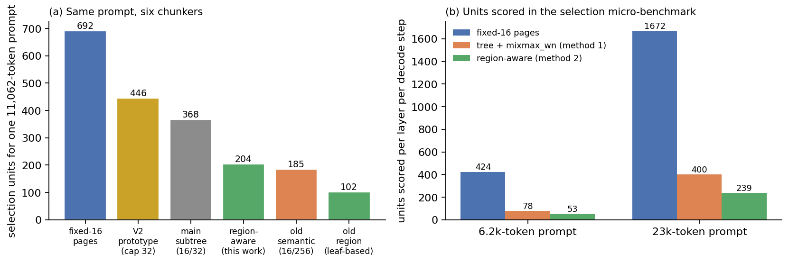
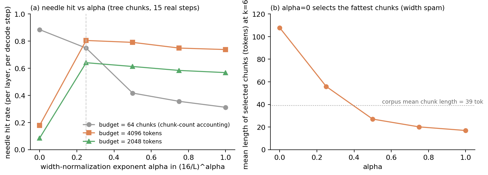
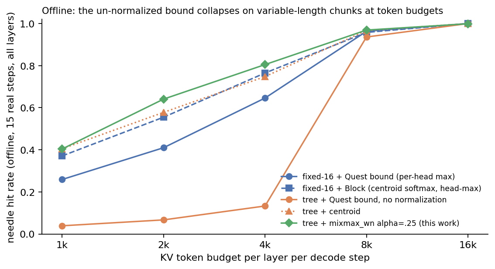
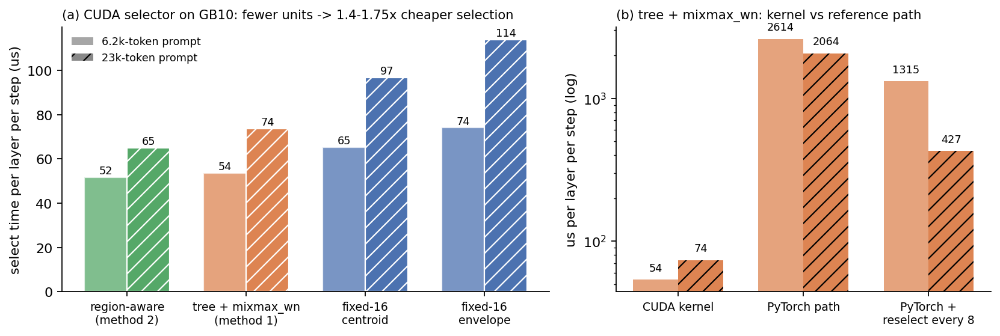
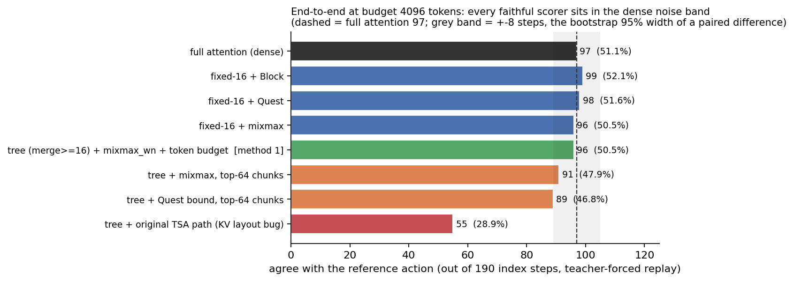
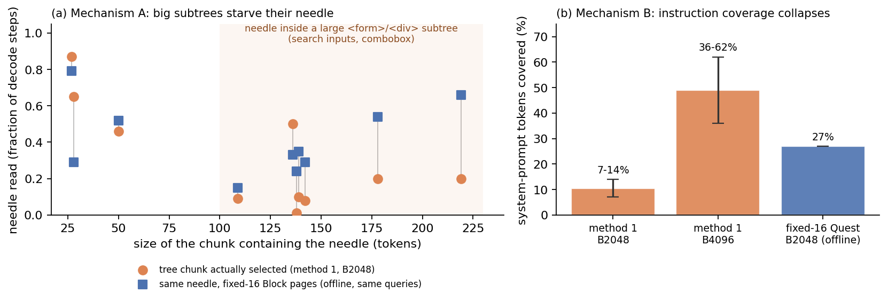
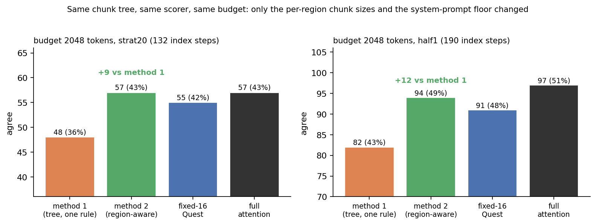
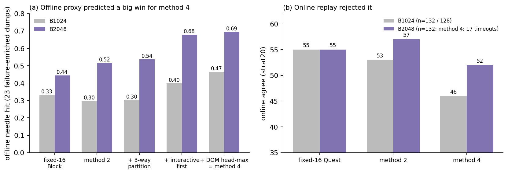

# 面向 Browser Agent 的 Sparse Attention:BrowserSparseAttention 项目总报告

**日期**:2026-09-03(实验窗口 2026-06 → 2026-09-02)
**模型**:Qwen3-VL-30B-A3B-Instruct(48 层,32 个 query head / 4 个 KV head,GQA group size 8,head_dim 128,MoE 30B 总参数 / 3B 激活),纯文本
**硬件**:NVIDIA GB10(sm_121,119 GB unified memory),spark00 / spark01
**代码**:`BrowserSparseAttention`(原名 TreeSparseAttention;`main` @ `60c4013`,分支 `shiqihe/region-aware` @ `5afd993`、`shiqihe/mixmax-main` @ `3bbb01b`)
**配套文档**(本报告是它们的独立综述,不必先读):`2026-08-23_scoring_function_study.zh.md`(打分函数与两个实现 bug 的全部细节)、`2026-08-28_mixmax_head_aggregation_design.zh.md`(贡献归属与相关工作)、`2026-09-01_codesign_report_mixmax_region_aware.zh.md`(region-aware 与 co-design 的实验)、`2026-08-07_speed_study_tsa_vs_quest_vs_block.en.md` / `2026-08-07_speed_study_tsa_vs_quest_vs_block.zh.md`(8 月初的速度研究)、`2026-09-02_chunking_comparison.zh.md`(五种切块方式在同一 prompt 上的对照)
**图**:`figures/bsa_report/fig01`–`fig17`(`make_figures.py` 可复现,全部数字来自上述文档与 `runs/sparse3way-20260721/` 下的原始结果)

---

## 阅读指南

本报告写给**没有接触过 sparse attention 的研究者**。§1 用一个 12-token 的 toy example 解释 sparse attention 是什么、在生成的哪个环节发生、传统方法(Quest、BlockSparse 等)怎么做;§2 说明 browser agent 的 prompt 结构为什么让传统做法失效;§3 逐一介绍本项目的四个组成部分——(1) 变长语义 chunking、(2) 新的打分函数、(3) 跨 query head 平均、(4) system prompt / history 与 DOM 的混合粒度及 budget 分配——每一部分都给出 toy 例子、代码位置和消融证据;§4–§5 是实验设置与结果;§6 用一张表总结与传统方法的差异;§7 给出贡献边界与后续方向。只想看结论的读者读 §0 和 §6 即可。

## 术语表(先读这个)

| 术语 | 定义 |
|---|---|
| **prefill / decode** | LLM 处理一个请求分两段:prefill 一次性读入整个 prompt;decode 逐个生成输出 token。每生成一个 token 叫一个 **decode step**。 |
| **KV cache** | prefill 时,prompt 中每个 token 在每一层、每个 KV head 都算出一对 key/value 向量并缓存;decode 时新 token 的 query 与这些 key 做点积决定"看哪里"。本模型每 token 约 98 KB(48 层 × 4 KV head × 128 维 × 2 向量 × bf16),2 万 token 的页面约 2 GB。 |
| **full attention(dense)** | 每个 decode step、每一层都读取全部 KV cache。 |
| **sparse attention** | 每个 decode step、每一层只读取 KV cache 的一个子集。本报告只讨论 **query-aware selection**(按当前 query 动态挑选,每步可以不同),不讨论永久删除 KV 的 eviction 类方法(H2O、SnapKV)。 |
| **attention head / GQA** | 每层有 32 个 query head;grouped-query attention(GQA)让每 8 个 query head 共享 1 个 KV head,共 4 组。选择 KV 时必须决定这 32 个 head 是各选各的还是共用一份选中集。 |
| **chunk / page / block** | **chunk** = 本报告的打分与选择单元(一段连续 token)。**page** = 显存里 KV 的存储单元(FlashInfer paged KV,本项目 page_size = 16 或 64);attention kernel 按 page 读取,选中的 chunk 会映射到它覆盖的 page。Quest 的 page、Vortex 的 block 都是"16-token 固定 chunk"。 |
| **budget(B)** | 每个 decode step、每一层允许读取的 KV token 上限,例如 B = 2048。budget 可以按 chunk 数(top-k)计,也可以按 token 数计;两者在变长 chunk 下差异很大(§3.4)。 |
| **always-include** | 无论打分如何都读取的部分:attention sink(序列最前 4 个 token)、最近 128 个 token、以及本次已生成的所有 token。所有方法相同。 |
| **summary(摘要)** | prefill 时给每个 chunk、每层、每个 KV head 算的一个廉价统计量,decode 时只用它打分而不读 key。两种:**envelope** = 逐维 max 向量 M 与逐维 min 向量 m;**centroid** = key 的均值。 |
| **upper bound scoring** | 用 envelope 算 Σ_d max(q_d·M_d, q_d·m_d):chunk 内**任何** key 与 q 的点积都不超过它,所以叫 upper bound(上界)。它回答"这个 chunk 里最好的 key 最多有多相关"。 |
| **width term** | 上式的等价改写 q·(M+m)/2 + Σ_d \|q_d\|·(M−m)_d/2 中的第二项;(M−m) 是 chunk 内 key 在每一维的散布范围,chunk 越长它天然越大。第一项称 center term。 |
| **centroid scoring** | q·mean(k):回答"这个 chunk 平均有多相关"。 |
| **dilution** | centroid 的失效模式:chunk 里只有一行是目标时,均值把它平均掉。 |
| **width bias** | upper bound 的失效模式:大而杂的 chunk 因 width term 大而得分高,即使里面没有任何匹配的 key。 |
| **needle / needle hit rate** | 参考轨迹在该步实际点击的元素(如 `[58]<input …>`)所在的 chunk 叫 needle;**needle hit rate** = 某层某 decode step 的选择把它选进 budget 的比例。模型读不到那一行就不可能输出正确编号,所以它是行为正确的必要条件。 |
| **attention mass / mass recall** | full attention 的 softmax 权重;一个 chunk 的 mass = 其中 token 的权重之和;**mass recall** = 选中 chunk 覆盖的总权重比例。mass 大量集中在 sink 与指令上,needle 通常只占很小份额——两个目标经常冲突。 |
| **agree / valid / none** | offline replay 指标。把参考轨迹某步的原始 context 原封不动喂给被测配置(**teacher-forced**),输出的元素编号与参考一致记 **agree**;编号存在于页面记 **valid**;没有输出编号动作记 **none**。分母只含 index-action 步。agree 低估真实正确率(选了另一个同样合理的元素也算不一致),且不等于在线任务成功率。 |
| **fidelity** | 被测配置与 full attention 输出相同动作的比例。 |
| **run-to-run variance** | full attention 自身重跑也会改变约 20% 的输出(batch 组成、数值非确定性);n≈130–190 时小于 5 步的差异不可解读,所有比较用配对 sign test 与 bootstrap 区间。 |
| **transparent regime** | budget 大到打分函数的差异在 end-to-end 指标上不可见的区间(本 workload 为 B ≥ 3k–4k token)。 |
| **region** | prompt 的语义区域:system prompt、任务与历史、DOM observation、收尾。 |
| **budget floor** | 把 budget 的固定比例预留给某个 region,region 内部仍按分数选;记号 sf25 = system-prompt floor 0.25。 |
| **admission(准入)** | 打分之后的装填:候选 chunk 按分数从高到低依次装进 budget,装不下就跳过,直到预算用完(贪心背包)。 |

---

## 0. 一页结论

**Sparse attention 是什么、什么时候做**:LLM 每生成一个 token,每一层的 attention 都要读一遍整个 KV cache。sparse attention 在 prefill 时给 KV cache 的每个 chunk 存一个摘要,在**每个 decode step、每一层**用当前 query 给所有 chunk 打分,只读取分数最高的、总量不超过 budget 的那部分。它不删除任何 KV,下一步可以选完全不同的子集。本项目的实现里,这个选择发生在每一层 attention 的前向函数内(`models/tree_sparse_patch.py:531-543`),摘要在 prefill 时按层计算一次(`python/tree_sparse_selector.py:562-641`)。

**传统做法**(Quest、Vortex BlockSparse、LServe、ArkVale 等):把 KV 每 16 个 token 切成一个固定大小的 page,与内容无关;每页存 envelope 或 centroid;每个 head 各自打分、各自选 top-k 页;budget 按页数计。

**Browser agent 的 prompt 不同在哪**:它有固定的结构——约 5.3k token 的 system prompt(规则、输出格式)、数百到上万 token 的任务与历史、0.7k–6k token 的 DOM observation(一行一个页面元素)。动作目标(要点击的元素)**只可能在 DOM 区**,而且以"一行元素"为最小语义单元;system prompt 只需要被覆盖、不需要细粒度。固定 16-token page 会把一行元素切成 2–4 页(图 3),编号与文本分属不同页;整齐的 page 数字也掩盖了"哪个区域拿到多少预算"这个真正决定成败的变量。

**本项目做了四件事**(§3):

1. **变长语义 chunking**:按 ChatML / DOM 树切块,一个 DOM 元素子树就是一个 chunk;region-aware 版本给 DOM 区用 6–64 token 的元素级块、给指令/历史区用 64–256 token 的粗块。同一个 11k-token prompt 上,选择单元从 fixed-16 的 692 个降到 204 个(图 14)。
2. **打分函数 mixmax_wn**:把 Quest 的逐维 upper bound 装进现有 kernel 结构,并对 width term 乘以 (16/L)^0.25 抵消长 chunk 的系统性高估。这是让变长 chunk 可用的关键:同一切分、不归一化时 end-to-end 显著落后(89 vs 96,p = 0.02),归一化后与 fixed-16 和 full attention 统计上不可区分(图 9)。归一化指数 0.25 与事后在真实 KV 上直接测得的 width 增长指数 β = 0.245 一致(图 6)。
3. **跨 query head 平均**:GQA 组内 8 个 query head 先平均成一个向量,4 个 KV head 的分数再取平均,全层 32 个 head 共用一份选中集。代价是少数 head 上的检索信号被稀释;实测 B ≥ 3k 时与 head-max 端到端无差异,B ≤ 2k 时有可测代价;换取 8× 更少的打分计算与 serving 引擎兼容的单页表。
4. **混合粒度 + budget 分配**:token 计的贪心 admission,加 system-prompt floor 0.25 保证指令覆盖。B2048 下把方法 1 的 48 提升到 57(= full attention,fixed-16 基线 55),half1 上 82 → 94(Quest 91,dense 97);B1024 下与基线配对打平(53 vs 55),但格式遵从显著更好(none 8 vs 31)。

**效率**:CUDA selector 上每层每步的选择时间 51.7–65.0 µs(region-aware)对 fixed-16 的 74.1–114.0 µs,快 1.4–1.75×(图 15)。但在这台机器、这个 MoE 模型上,attention 只占 decode step 的 ≤ 15%,任何 sparse attention 的端到端加速上限都只有约 1.09×(图 16);sparse attention 的收益在 dense MHA 模型、更长 context 或更大 batch 时才显著(上游在 B200 / Qwen3-VL-8B 上测得 1.74–3.53×)。

**没有主张的**:upper bound 公式(Quest)、head 池化(TSA 既有)、语义树切分本身(TSA 既有)、跨步复用选择(LServe)都不是本项目的贡献;本项目也**没有**在准确率上超过 fixed-16 基线(所有差异在 run-to-run variance 内),主张是"在同等 KV 读取量下追平,且打分单元少 3–5×、结构信息可用"。已被否证的方向(hierarchical descent、DOM head-max、交互元素优先准入、三区硬划分)在 §5.5。

---

## 1. Sparse attention 是什么

### 1.1 生成一个 token 时发生了什么


*图 1:一个 decode step 里,full attention(a)与 query-aware sparse attention(b)分别读了什么。(b) 里每个 chunk 的摘要 M,m 在 prefill 时算好;decode 时只拿 q 和摘要打分,选出的 chunk(橙框)加上 always-include 的 sink 与最近 token(蓝色)才被真正读取。*

Transformer 每层的 attention 对当前 token 做三件事:由它的隐状态算出 query 向量 q;与 KV cache 里此前每个 token 的 key k_i 做点积 q·k_i,softmax 后得到权重;按权重把对应的 value v_i 加权求和。prompt 的 k、v 在 prefill 时算一次并缓存,之后不变;q 每个 decode step、每一层、每个 head 都是新的——它编码的是"现在在找什么"。模型正要写 `"index": 58` 时,某些 head 的 q 与 DOM 里 `[58]<input …>` 那几个 token 的 k 会有很高的点积。

**成本在哪**:每生成一个 token,每一层都要把全部 n 个 (k, v) 从显存读一遍。context 2 万 token 时每 step 读约 2 GB;这就是 sparse attention 要削减的量。

**Sparse attention 的做法**(图 1b):

- **prefill 时**给每个 chunk、每层、每个 KV head 算一个摘要:envelope(逐维 max/min)或 centroid。本项目:`python/tree_sparse_selector.py:562-641` `compute_centroids`,每层调用一次,摘要量化成 fp8 存储(每 decode step 每层都要整读一遍摘要,fp8 减半流量)。
- **每个 decode step、每一层**:用该层的 q 给所有 chunk 打分、排序、按 budget 装填,再把选中 chunk 映射到 page,只对这些 page 做 attention。是的,**选择在每个 decode step、每一层都重新做**——因为 q 每步每层都不同。代码位置:`models/tree_sparse_patch.py:531-543`(每层 attention 前向里调用 `selector.select_pages(query=q, layer_id=…)`),`models/direct_decode.py:1194-1198`(无 HF 分发的快路径)。CUDA-graph 模式下有一个变体:为了能把整个前向捕获成静态图,选择用**上一步**的 q 在图外先算好(`direct_decode.py:813-830` `_pre_pass`,"lagged query")。
- **always-include**:sink(前 4 token)、最近 128 token、已生成 token 永远读取(`TreeSparseConfig` 默认值,selector `:65-66`;装填逻辑 `:1349-1380`)。
- **budget 记账**:按 chunk 数(top-k,原 TSA)或按 token 数(本项目新增,`:328-375`)。

选择的质量只取决于两件事:**chunk 怎么切**(chunk geometry)和**摘要怎么打分**。选错 = 把真正高点积的 key 所在 chunk 排到 budget 之外,模型就看不到那个元素。

### 1.2 传统 sparse attention 怎么做

| 方法 | 选择单元 | 摘要 | 打分 | head 处理 | budget |
|---|---|---|---|---|---|
| **Quest**(Tang et al., ICML 2024) | 固定 16-token page | 逐维 min/max envelope | Σ_d max(q_d M_d, q_d m_d)(upper bound) | 每个 head 各自打分、各选各的 top-K 页 | 页数 |
| **BlockSparse**(Vortex, Infini-AI-Lab) | 固定 page | centroid | q·centroid → softmax(scale 0.09) | 每 head 各自 softmax,组内取 max,每 KV head 选页 | 页数 |
| **LServe**(MLSys 2025) | 固定分层 page(物理页 = g 个逻辑页) | 逻辑页 min/max,物理页取 max | 同 Quest | — | 页数;选择结果跨 ≤ 8 步复用 |
| **ArkVale**(NeurIPS 2024) | 固定 page | bounding-volume digest(envelope 的推广) | 类 Quest | 逐 head | 页数 |
| **ShadowKV**(ICML 2025) | 固定 chunk | mean-pooled key(centroid 类) | 点积 | 低秩/池化 | 块数 |
| **本项目** | **变长语义 chunk(DOM/ChatML 树对齐,按 region 定粒度)** | envelope(fp8) | Quest bound + width 归一化 | GQA 组内平均,KV head 间平均,共用选中集 | **token 数 + region floor** |

共同点:全部用固定大小、与内容无关的单元;都在每个 decode step、每层重新选;都保留 sink 与最近窗口。LServe 自己指出 "Quest fails when page sizes increase"——固定 page 一旦变大,envelope 就松,精度就掉;这正是变长 chunk 必须面对的问题(§3.2)。

### 1.3 Toy example:三种打分在同一组数字上的差别

设 head_dim D = 4,12 个 token 切成 3 个 chunk、每个 4 token,当前 q = [2, −2, 1, −1]。

| chunk | 4 个 key | q·k(full attention 的 logit) | 现实对应 |
|---|---|---|---|
| **A**(needle) | [2,−2,1,−1] · [0,0,0,0] · [−1,1,0,0] · [0,0,−1,1] | **10**, 0, −4, −2 | 一个强匹配 key + 三个无关 token:含目标元素的 DOM 子树 |
| **B**(大而杂) | [3,3,0,0] · [−3,−3,0,0] · [0,0,3,3] · [0,0,−3,−3] | 0, 0, 0, 0 | 没有任何 key 匹配 q:导航栏、链接堆 |
| **C**(小而同质) | [1,−1,1,−1] × 4 | 6, 6, 6, 6 | 四个几乎相同的中等匹配 key:cookie 按钮 |

Full attention 对 12 个 logit 做 softmax:A 的第一个 key 拿到 **93.2%** 的权重,C 合计 6.8%,B 合计 0.02%。budget 只够读 1 个 chunk 时,正确答案是 A。

prefill 时算出的摘要(与 q 无关):

| chunk | M(逐维 max) | m(逐维 min) | c = (M+m)/2 | w = (M−m)/2 | centroid |
|---|---|---|---|---|---|
| A | [2,1,1,1] | [−1,−2,−1,−1] | [.5,−.5,0,0] | [1.5,1.5,1,1] | [.25,−.25,0,0] |
| B | [3,3,3,3] | [−3,−3,−3,−3] | [0,0,0,0] | [3,3,3,3] | [0,0,0,0] |
| C | [1,−1,1,−1] | [1,−1,1,−1] | [1,−1,1,−1] | [0,0,0,0] | [1,−1,1,−1] |


*图 4:同一组数字下五种打分给 A / B / C 的分数。黑色是 chunk 内真实最大点积。*

| 打分 | 公式 | A | B | C | budget = 1 时选谁 |
|---|---|---|---|---|---|
| Quest upper bound | Σ_d max(q_d M_d, q_d m_d) = q·c + \|q\|·w | 2 + 8 = **10** | 0 + 18 = **18** | 6 | 有 B 时选 B ✗ |
| TSA 原版 2-corner | max(q·M, q·m) = q·c + \|q·w\| | max(2, 2) = **2** | 0 | 6 | C ✗ |
| centroid | q·mean | **1** | 0 | 6 | C ✗ |
| mixmax_wn(A、C 为 16 token,B 为 256 token) | q·c + (16/L)^0.25·\|q\|·w | 10 | 0 + 18 × 0.5 = 9 | 6 | **A ✓** |

五个观察,分别对应后文的一个机制:

1. **Quest 给 A 的 10 恰好等于真实最强 key 的点积**。逐维 max 是 q·k 在 chunk 包围盒 [m_d, M_d] 上的精确上界;A 的 needle 在每一维都是极值,bound 是紧的。这就是 envelope 的价值:单个强匹配 key 就能抬高整个 chunk。
2. **2-corner 只给 A 打 2**。q 各维符号混合(+,−,+,−)时,先逐维求和再取 max 让 width term 正负相消(3 − 3 + 1 − 1 = 0),只剩 center term——数学上退化成"用 chunk 中点打分",丢掉了对单个强 key 的敏感性(§3.2)。
3. **centroid 给 A 打 1**:needle 被三个无关 token 平均掉,即 dilution。
4. **Quest 给 B 打 18,高于 A**:B 里没有任何匹配的 key,但包围盒大(w = 3),\|q\|·w 白送 18 分——即 width bias。upper bound 只在 chunk 里真有 key 坐在乐观角上时才紧。
5. **C 在所有打分下都是 6**:小而同质的 chunk 的 envelope 宽度 (M−m) 为 0,centroid 就是 key 本身——三种打分没有差别。fixed-16 的 page 大多接近 C 型,所以打分函数在 fixed-16 上差异很小(§5.1 的 transparent regime);变长 chunk 同时制造 A 型和 B 型,两种失效一起放大。

第 6 行的 width 归一化(§3.2)是本项目对第 4 点的修正:B 若是 256-token 的大块、A 是 16-token 的小块,把 B 的 width term 乘以 (16/256)^0.25 = 0.5,排序恢复。

---

## 2. Browser agent 的 prompt 有什么不同

### 2.1 prompt 的结构与 attention 的去向


*图 2:(a) browser-use agent 每步发给 LLM 的 prompt 结构(两个典型尺寸);(b) full attention 的权重按 region 的分布(15 个真实 step、全部层的平均,`region_sweep.py`)。*

每一步,agent 把如下 prompt 交给 LLM,要求输出一个 JSON 动作(含目标元素编号):

```
[system prompt]   ~5.3k token:操作规则、输出格式、示例 DOM     —— 不可能成为动作目标
[任务 + 历史]      数百至 1.3 万 token:目标与此前各步          —— 同样不可能成为动作目标
[DOM observation] 0.7k–6k token:页面元素列表,一行一个元素
                   例:[58]<input placeholder=Find a recipe …>   —— 动作目标(needle)只在这里
[URL 等收尾]       几十 token
```

三个事实决定了设计:

- **动作目标只在 DOM 区,且以"一行元素"为最小语义单元**:编号 `[58]` 与它的文本必须一起被读到,模型才能输出 58。
- **system prompt 只需要覆盖(mass),不需要粒度**:它拿到 22% 的 attention mass,但从不是动作目标;把它切细没有意义,漏掉它则模型丢失输出格式(§5.3 机制 B)。
- **needle 与 mass 是两个冲突的目标**:mass 被 sink(54%)与指令主导,DOM 整体只有 12%,而 needle 只是 DOM 里的一行。按 mass 选 chunk 的方法(centroid 家族、原 TSA)会把预算花在指令上而漏掉 needle;按 upper bound 选的方法则相反。

### 2.2 固定 page 在 DOM 上的问题:一个真实例子


*图 3:同一个真实 prompt(Allrecipes 首页,一条 WebVoyager 轨迹的第 2 步,11,062 token)的 DOM 区 tokens 9584–9866 在五种切块方式下的边界。红色区域是本步的 needle——搜索框 `[58]<input>`。数据来自 `CHUNKED_*.md`。*

- **fixed-16**:`[58]<input …>` 这一行(约 37 token)横跨 4 个 page,编号 `[58]` 在一页、placeholder 文本在另两页。要"读到这个元素"必须同时选中 3–4 页(48–64 token);page 的摘要各自只描述半行元素。
- **旧的语义 leaf 切块(一套参数 16/256)**:元素被并进一个 91-token 的大块(与 Newsletters 链接等同块),另有 2-token 的碎块(叶子之间父节点的空白 token)——大块稀释 needle、碎块浪费单元,两头都不占(§5.3 机制 A 的切块根源)。
- **main 的 subtree 切块(16/32)**:元素被切成 [9759–9790] 与 [9791–9822] 两半——32 的上限对 DOM 元素行仍太小。
- **region-aware(本项目)**:`[58]<input>` + `[113]<button 搜索>` + `[814]<div>` 合成一个 64-token 块——搜索框与搜索按钮恰好是本步的两个候选动作,一次选中。
- **V2 原型**(上游提出的内容驱动切块,未部署):按行与括号对齐,元素级,但单元数最多(446)。

### 2.3 工作点

context 6k–23k token;每步重新 prefill(历史以文本重发);生成短(一个 JSON 动作,几十到一千 token)。budget 关心的范围是 1k–4k token(约为 context 的 1/4 到 1/20)。

---

## 3. 方法:Browser Sparse Attention 的四个组成部分

### 3.1 组成部分 1:变长语义 chunking

**树**:`python/tree_parser.py:90` `parse_webarena_tree` 把 prompt 的 token 流解析成树——ChatML 轮次(system / user / assistant)为顶层,DOM observation 里每一行 `[N]<tag …>` 按缩进深度成为 `actree_node`,其余文本按段落成节点。

**从树到 chunk**(`tree_parser.py:880-981` `extract_subtree_chunks`):整个子树(标签 + 内容 + 闭合)不超过 max 就打包成一个 chunk;过大的节点下钻,其开头/结尾残余 token 贴回首/尾子块(标签不跨节);小块只在同一父节点内合并(不跨兄弟);保证返回的 chunk 精确平铺整个序列。

**region-aware**(`tree_parser.py:1015-1069` `extract_region_chunks`):

1. 用正则在第一个 `<|im_start|>user` 之后找首/末个 `[N]<`,定出 DOM 区间 [dom_lo, dom_hi](`:998-1012` `find_dom_token_span`);
2. 全文先按 (6, 64) 细跑一遍 subtree 切块;
3. 与 DOM 区间无重叠的相邻块贪心合并到 ≥ 64、再按 ≤ 256 硬切;DOM 区间内的块原样保留。

结果是"指令/历史区粗块、DOM 区元素块"的两套粒度,由 `TSA_HYBRID_GEOM=1`(standalone)或 `BSA2_CHUNK_EXTRACT=region`(sglang)启用,参数 `TSA_DOM_MIN/MAX = 6/64`、`TSA_OTHER_MIN/MAX = 64/256`(selector `:198-207`)。



*图 14:(a) 同一个 11,062-token prompt 在六种切块下的单元数(`2026-09-02_chunking_comparison.zh.md`);(b) selection 微基准里两个真实 prompt 的打分单元数。*

切块的演进:旧的 leaf 切块(叶子 + 叶子间 gap 独立成块,gap 不合并)在一个 prompt 上产生 103 个 < 16 token 的碎块,已被 subtree 切块取代;main 的 subtree 切块 max = 32 让散文区 82% 的边界退化为固定步长;region-aware 在 DOM 区用 64 的上限、指令区用 256,单元数 204,是三者中唯一同时满足"元素不被腰斩"和"指令区粗块"的方案。

**为什么不直接把 Quest 的 page 调大**:均匀大 page 在每一处付"粒度税"——选一个 64-token page 去拿一个 6-token 元素浪费 58 token 的预算,且 page 边界仍与元素无关;变长 chunk 只在语义连贯处大,边界与元素对齐。fixed-64/32 同预算的直接对照未在本 workload 实测,是应补的 ablation。

### 3.2 组成部分 2:打分函数 mixmax_wn

三个公式(每个 KV head h 的 group-mean query q̄_h,chunk 的 envelope M、m,长度 L):

```
2-corner(TSA 原版):  s = max( q̄·M , q̄·m )
mixmax:               s = q̄·(M+m)/2 + Σ_d |q̄_d|·(M−m)_d/2          ← 恒等于 Quest 的逐维 upper bound
mixmax_wn:            s = q̄·(M+m)/2 + (16/L)^0.25 · Σ_d |q̄_d|·(M−m)_d/2
```

**为什么 mixmax 就是 Quest 的公式**:标量恒等式 max(a, b) = (a+b)/2 + \|a−b\|/2,代入 a = q_d M_d、b = q_d m_d 并利用 M_d ≥ m_d,得 max(q_d M_d, q_d m_d) = q_d(M_d+m_d)/2 + \|q_d\|(M_d−m_d)/2;对 d 求和即 mixmax。数值验证(D = 2,q = (2, −1),M = (3, 5),m = (1, −4)):Quest = max(6, 2) + max(−5, 4) = 10;mixmax = 3.5 + 6.5 = 10;而 2-corner = max(q·M, q·m) = max(1, 6) = 6 < 10——整向量取 max 强迫各维选同一个角,bound 变弱,这就是 §1.3 第 2 点的退化。改写成 center + width 的两个工程理由:width term 被单独暴露,归一化才有落点;c、w 每 chunk 预计算一次,打分只需两个 GEMM(`_score_mixmax` 的 `ctr`/`wid` 两行,selector `:1338-1339`)。

| 组成 | 来源 | 本项目的贡献? |
|---|---|---|
| 逐维 upper bound | Quest 原样 | 否 |
| GQA head-mean(组内平均 + KV head 间平均) | TSA 既有,业界常见 | 否(仅提供消融证据) |
| **width term 的长度归一化 (16/L)^α** | 本项目 | **是**;文献里 bound 类方法全部用定长单元,变长单元的方法全部用 centroid(ClusterKV、Tactic;DHSA 对 mean 聚合做 √L 缩放,对象不同),这一格是空的 |

**为什么需要归一化——width bias 的来源**:width term 由 chunk 内 key 的逐维极值决定;L 个样本的极值随 L 增长(iid 高斯近似 ~√(2 ln L)),所以长 chunk 的 upper bound 系统性偏高,与是否含目标无关;center term 不随 L 系统性膨胀。因此修正只该作用于 width、随 L 单调递减、增长缓慢。


*图 6:在真实 web-agent KV dump 上直接测量 width term 随 L 的增长(2 组 dump × 3 请求 × 4 层,每档 150 个随机连续 span;`scoring_case_study/measure_width.py`)。拟合斜率 β = 0.245(逐 dump × 层范围 0.192–0.279),与部署的 α = 0.25 重合;修正后 L = 8–256 全程平坦(±7%)。实测 256-token 膨胀 1.86×,比 iid 理论的 1.41× 更快——超出部分来自语义块的内容异质性。*

**α 的选择**:先在失败富集的 dump 上按任务指标扫描 {0, 0.25, 0.5, 0.75, 1}(图 7),后用图 6 的几何测量独立验证。锚点 16 = baseline page 的尺度:L = 16 的 chunk 折扣 = 1(分数尺度不动,退化到 fixed-16 时逐 bit 等于 Quest),L = 64 → 0.707,L = 256 → 0.5,L = 6 的元素块 → 1.28。



*图 7:α 扫描(tree chunk,15 个真实 step,`sweep_wn.md`)。(a) 按 chunk 数计 budget 时 α = 0 最好——width term 本身就是 needle 信号;按 token 数计 budget 时 α = 0 崩溃(0.18)、α = 0.25 最好(0.81)。(b) 原因:α = 0 选中的 chunk 平均 108 token(语料均长 39),同为 top-64 实际多读 1.6× KV——width bias 等于隐性的 budget 膨胀。*



*图 8:offline needle hit rate 随 token budget 的变化(`sweep_v3.md` / `sweep_wn.md`)。不归一化的 Quest bound 在变长 chunk 上 B ≤ 4k 时几乎失效(0.04–0.13);归一化后(绿)在每个 budget 上都不低于 fixed-16 的两种基线。*

**end-to-end 消融**(half1,190 步,B4096,配对):同一切分,无归一化的 tree + Quest bound = 89(vs fixed-16 Block 99,sign test p = 0.02,显著落后);mixmax_wn = 96(p = 0.65,不可区分)。即归一化把变长 chunk 从显著落后拉进 full attention 的 run-to-run variance 范围。

**代码**:PyTorch 参考 `python/tree_sparse_selector.py:1327-1347` `_score_mixmax`;CUDA kernel `csrc/ts_tree_sparse.cu:402` `score_fp8_mixmax_kernel`(与参考实现的选中 page 集合 Jaccard 0.99–1.00);sglang 端 `bsa_sglang/selection.py:66-93` `score_chunks_mixmax`。摘要以 fp8(e4m3 + per-vector scale)存储,实测对排序无可见影响(`legacy_fp32 ≈ legacy`,Δ ≤ 0.002)。

### 3.3 组成部分 3:跨 query head 平均

**数据流**(公式里只写了一个 q̄,实际有两次平均):

```
32 个 query head
  →(第一次平均)GQA 组内 8 个平均成 1 → 4 个 q̄_h         (selector :1153 _group_query_heads)
  → 每个 q̄_h 与自己 KV head 的 envelope 算 bound → 每 chunk 4 个分数
  →(第二次平均)4 个分数取 mean → 每 chunk 1 个分数        (selector :1347  (ctr + wid).mean(dim=1))
  → admission → 该层全部 32 个 head 共用同一份选中集
```

**为什么这样做**:serving kernel 每层只 gather **一份**共享的 page 集合——主流 serving 引擎(sglang / vLLM)的 block table 是 per-sequence 的,没有 per-head 页表的 decode kernel;选择路径(top-k、索引构建、reselect 缓存)只做 1 份而非 4 份;每单元 4 次点积而不是 32 次。原版 Quest 每个 head 各选各的 top-k 页,靠自带的研究原型 kernel;本 harness 里的 fixed-16 "Quest"/Block 基线用的是它们的打分公式 + 与本项目相同的 head-mean + 共享选中集约定,所以内部对比在这条轴上公平,对外应写 "Quest-style scoring"。


*图 5:head 聚合的 toy(数值为演示;来自 `2026-09-01_codesign_report_mixmax_region_aware.zh.md` §4.2)。g4 是检索型 head:任务说"搜索"→ 对搜索框强响应(3.2);g1 响应版式/醒目文本(横幅 2.6)。head-MEAN 把 E3 的 3.2 稀释成 1.08,低于所有导航链接(1.15),needle 在 budget 小时会出局;head-MAX 保住它,但也把横幅抬到 2.6。*

**代价与边界(实测)**:

- B ≥ 3k:head-mean 与 head-max 端到端不可区分——fixed-16 上 mixmax(head-mean)96 vs Quest(head-max)98 vs Block 99 vs dense 97(n = 190,配对全不显著)。needle 即使被平均稀释,仍稳稳排进 budget。
- B ≤ 2k:有真实代价。23 个失败富集 dump 上 fixed-16 Block(head-max)needle 0.537 > tree head-mean 0.479;把 Block 式 head-max 搬到 tree 单元最高到 0.515。
- 独立佐证:LessIsMore(arXiv 2508.07101)在 reasoning 模型上实测各 head 的 ground-truth top-k token 高度重叠,并据此把 per-head 选择换成跨 head 统一选中集,GQA 消融显示统一集 > per-head 独立。
- 只给 DOM 元素块换 head-max 的变体(§5.5 的 co-design)online 净负,故部署配置全部 head-mean。

### 3.4 组成部分 4:混合粒度与 budget 分配

组成部分 1 决定了每个 region 的 chunk 大小;这一部分决定预算怎么在 region 之间分。

**admission**(`python/tree_sparse_selector.py:328-375` `_select_by_budget_or_topk`;sglang 端 `bsa_sglang/selection.py:179-201` `token_budget_chunk_mask`):

1. 所有 chunk(6-token 元素块与 256-token 指令块)进入**同一个** mixmax_wn 排序——跨尺寸可比性完全依赖 §3.2 的归一化;
2. **system-prompt floor**(`TSA_SYS_FLOOR = f`):先在第一个 user turn 之前的 chunk 里按分数装满 f·B(`:344-359`),未用完的余量退回全局池;
3. 其余预算按全局排序贪心装填,直到累计 token ≥ B(`:360-362`);
4. always-include 照旧。

**超参数**:

| 超参 | 含义 | 尝试值 | 选定 | 依据 |
|---|---|---|---|---|
| α | width 归一化指数 | 0 / 0.25 / 0.5 | **0.25** | 0 显著劣化(89 vs 96);0.5 过度惩罚长 chunk;实测 β = 0.245 |
| f | system-prompt floor | 0.05 / 0.25 / 0.35 | **0.25** | online 50 / **57** / 56;0.25 与 0.35 差 1 步,取更省的 |
| DOM min/max | 元素块合并下限 / 切分上限 | — | **6 / 64** | offline needle 扫描:min 太小则单元数爆炸;max 保证长元素行不并入邻行 |
| 指令区 min/max | 粗块合并下限 / 切分上限 | — | **64 / 256** | offline mass-coverage 扫描;256 与 kernel page 对齐 |
| page_size | 显存 page | 16 / 64 | **16** | 小 page 让 chunk→page 映射少读无关 token(B4096 实读 4506 vs page64 的 5032) |

**一次完整的 admission(toy,B = 128,不计 always-include)**:指令区粗块 C1(规则,80 token,分 1.40)、C2(任务,30 token,1.50);DOM 元素块 E1 横幅(12,1.00)、E3 搜索框(6,1.08)、8 个导航链接 N1–N8(各 6,约 1.15)。floor 0.25 → 32 token:C2 进,余 2 退回。全局池 98 token 按分数:C1(80)进,余 18;N1、N2、N3 进,余 0——E3 出局。这就是 §5.3 里反复出现的模式(版式响应块与长指令块挤掉唯一带检索信号的元素),也是 B ≤ 2k 时 head-mean 的代价所在;region-aware 的解法不是改聚合,而是让 E3 与 N 同为 6-token 块参与同一排序、并用 floor 保证 C 区的覆盖不必靠挤占 DOM。

### 3.5 工程实现与效率

- **CUDA selector**:prefill 计算 fp8 envelope;decode 时打分 kernel + fused top-k + page bitset(`csrc/ts_fused_page_select.cu`);chunk → page 映射为区间并集(`selector :1242-1298`)。选中的 10-token chunk 会拉进它所在的整个 page,跨页 chunk 拉进两页,所以"k 个 chunk"既不等于 k 页也不等于固定 token 数——对速度诚实的口径是 page 数 × page_size,报告中的 KV 读取量按此计。
- **1024-page 容量 bug 修复**:原 kernel 的共享内存 page bitset 只有 1024 页且标记循环无边界检查,page 16 下任何 > 16.4k token 的请求都会 illegal memory access;已扩到 4096 页并加 clamp(`ts_tree_sparse.cu`、`ts_fused_page_select.cu`,可复现:任何 `seq_len > 16384` 的 `select_and_build_indices`)。
- **跨步复用**(LServe 的思想,`TSA_RESELECT_K = k`,selector `:909-913` + `:1255-1298`):每 k 个 decode step 才重新打分,其间用缓存的 chunk 集合重建 page(sink/recent/已生成窗口按当前 seq_len 重算)。相邻步选中集 Jaccard 0.81、隔 8 步 0.71;k = 8 时 agree 55 vs 58(p ≈ 0.63,不显著),PyTorch 路径 wall −21%。CUDA 路径上不用(fused 重选 54 µs 已比 python 重建便宜)。
- **sglang 后端**(`bsa_sglang/backend_v2.py`,`BSA2_*` 环境变量):同一套切块器与打分;token budget 的贪心装填用纯 device 算子实现(无 host sync,graph-safe);region floor 在 CUDA-graph 捕获下不可用(需 `--disable-cuda-graph`)。
- **限制**:batch > 1 的 CUDA mixmax kernel 未实现(路由到逐请求路径);token budget / floor / region 目前只在 PyTorch 打分路径(CUDA 路径只支持 chunk 数 top-k),所以本报告所有 end-to-end 数字都带着 PyTorch 路径的时间开销(对各配置一视同仁,配对比较不受影响)。



*图 15:selection 微基准(GB10,200 次 select,真实 prompt 的 token 流 + 合成 K/q;`bench_select.py` / `bench_select2.py`)。(a) CUDA 路径:region-aware 51.7–65.0 µs vs fixed-16 envelope 74.1–114.0 µs,1.4–1.75×;单元数少 5–7× 但 kernel 有固定 launch 开销,所以加速比小于单元数比。(b) CUDA 路径比 PyTorch 参考路径快 24–54×;每 8 步复用把 PyTorch 路径的开销降 2–4.8×。*

---

## 4. 实验设置

**Serving**:`serve.py`(OpenAI 兼容),temperature 0,xgrammar 按 JSON schema 约束输出(sparse 下不约束会退化成畸形 JSON),`--disable-cuda-graph`(GB10 上 MoE grouped_mm 与 CUDA graph 冲突)。full attention 基线 = 同一代码路径、`top_k = 100000`(选择器选中全部 chunk,`selector :896-907` 的 dense bypass)。

**数据**:WebVoyager(643 任务、15 个真实站点)+ GAIA-web(90 任务)。参考轨迹由多模态 agent(Qwen3.5-omni)在真实浏览器里走出,只取成功任务。
- **half1**:50 个任务 / 332 步 / **190 个 index-action 步**(按类别 × 长度分层抽样);
- **strat20**:half1 的子集,20 任务 / 15 站点 / **132 个 index 步**;
- **机理 dump**:15 步(8 个 selection-sensitive + 4 对照 + 3 Wolfram)与 23 步(13 个 B2048 失败/成功 + 10 个 B4096 不一致)的全层 K、每 decode step 的 q、每层实际选中集(约 10–16 GB)。

**指标**:agree / valid / none / fidelity(§术语表);needle hit rate、mass recall(offline);配对 sign test 与 bootstrap 95% 区间。同配置重跑 n = 190 时 agree 差约 1 步;跨配置差 ≥ 3–5 步才有解读意义。

**budget 对齐**:fixed-16 用 page 16 × top-k(k = 128 / 256 对应 B = 2048 / 4096);tree 用 token budget。两者的实际 KV 读取量(page 数 × 16)在 B4096 时为 4096 vs 4506(+10%,chunk → page 映射的代价),B2048 为 2048 vs 2341。

**方法学事故(已修复,影响历史结论)**:
1. **KV 布局 bug**(`2026-08-23_scoring_function_study.zh.md` §3):原 TSA 把 FlashInfer 按页交错的一维 KV buffer(`kv_cache.py:69` `elems_per_page = 2 * page_size * H_kv * D`,每页先 K 块后 V 块)当作 `[tokens, H_kv, D]` 的行布局索引(`ts_tree_sparse.cu:81-82` `k_idx = physical_loc*H*D + head*D + d`),page 0 之后的 token 一半读到 value、一半读到错页的 key。后果:2026-08-21 之前所有基于 TSA 默认路径的数字(6 月的 top-k 32 在线成功率 0.41% vs dense 69.7%、8 月初的 3-way 报告)都是在噪声摘要上做的选择,全部作废。同一套打分数学换到修复后的路径,同批步骤 agree 13.8% → 58.6%。`main` 已改成 K/V 分离的 pool,并在 `compute_centroids` 入口断言(selector `:581-591`)。
2. **1024-page 容量 bug**(§3.5)。
3. **B1024 的 fixed-16 基线配置错误**:首测用 flat 模式默认 `max-chunk-size 256`,chunk 数(约 30)< top-k 64 → 实际全选 = full attention。修正后 55。教训:每条基线必须核对实际读取的 KV 量。

---

## 5. 结果

### 5.1 B4096:所有忠实打分与 full attention 不可区分



*图 9:half1 190 个 index 步、B = 4096 token 下的 agree(`2026-08-23_scoring_function_study.zh.md` §9 Stage C)。*

- fixed-16 上三种忠实打分(Quest、Block、mixmax)与 dense 挤在 ±2 步内;Quest 与 Block 有 144/190 步输出逐字相同,分歧 ≈ 重复噪声。这是 **transparent regime**:budget 足够、page 足够细时,打分函数对结果不可见。
- tree 几何里,方法 1(合并 ≥ 16 + mixmax_wn + token budget)是唯一追平的配置(96,fidelity 79%,valid 156 为全场最高);不归一化的 tree + Quest 显著落后(89,p = 0.02)。
- 为什么 per-layer needle hit 0.65–0.90 就够:page 选择每层独立,模型只需在部分层拿到证据;B4096 的 10 个不一致 step 的 dump 复盘显示,5 个"真损失"里 3 个同配置重跑即变对,其余 needle 在 57–99% 的 decode step 里被选中、选错的元素与 needle 在同一或相邻 chunk——是决策错误,不是选择错误。

### 5.2 budget 维度:方法 1 在 2k–3k 之间塌缩,region-aware 修复了它


*图 10:strat20 132 个 index 步上,agree 随 budget 的变化。*

- fixed-16 从 B4096 到 B1024 几乎无损(59 → 55 → 55):16-token page 的广度让它在小 budget 下稳健。
- 方法 1 在 B3072 = dense(57),B2048 跌到 48(fidelity 57% vs fixed-16 的 63–66%,真损失 15 vs 10)——塌缩边界在 2k–3k 之间,约等于 system prompt 高 mass 段与 DOM needle 区的联合覆盖需求。
- 方法 2(region-aware + floor 0.25)在 B2048 = 57 = dense,B1024 = 53 vs 基线 55(配对 13 胜 14 负,不显著),且 valid 123 vs 100、none 8 vs 31——B1024 下的损失模式从"格式崩坏"变成"元素辨析"。

### 5.3 小 budget 下的两个失效机制及其各自的修复



*图 12:B2048 的 13 个失败/成功 step 的 dump 复盘(`case_discord2048_B2048.md`)。(a) needle 在 109–219 token 的 `<form>`/`<div>` 子树里时,方法 1 几乎从不选中它(0.01–0.20),fixed-16 的 page 对同一 needle 命中 0.15–0.66;小块 needle(23–41 token)没有这个问题。(b) 方法 1 在 B2048 下 system prompt 只覆盖 7–14% 的 token(B4096 时 36–62%),两个 1023 步仍未产生动作的 none 案例与此一致。*

两个机制在固定 budget 下互相冲突:给 system prompt 保底会从 DOM 抽预算加剧机制 A;拆大 chunk 又让碎片抢小 needle 的预算。三次"只改选择"的尝试(sub-block 分层打分、tree + fixed-16 混合分配、按窗口配额)offline 都失败。解法是把两个机制交给两个不同的组件:


*图 13:B2048、strat20 132 步。只加 floor 0.05 不改切块:agree 48 → 50、none 40 → 26(机制 B 被修复,机制 A 仍在);再换成 region-aware 切块:57、none 19(低于 full attention 的 33)。*



*图 11:方法 1 → 方法 2 在两个评测集上的同 setting 对照(唯一变量是分区域的切块参数 + floor)。strat20 +9(17 胜 8 负,p = 0.108),half1 +12(29 胜 17 负,p = 0.104);方法 2 相对 fixed-16 的 +2 / +3 在 run-to-run variance 内。half1 的方法 1 行是 tree + Quest-style 打分、chunk 数 k = 32(≈ 2k token)。*

### 5.4 效率与端到端速度的真实边界

打分单元 1/3–1/7、selection 快 1.4–1.75×(图 14、15)是可复现的。但端到端 decode 速度是另一回事:


*图 16:(a) 8 月初在 GB10 上对 30B-A3B、29.5k-token prompt 的 decode step 拆解(`2026-08-07_speed_study_tsa_vs_quest_vs_block.en.md` §8):MoE expert GEMM 占 50%,paged attention 读满 29.5k KV 也只有 ≥ 13 ms(8.5%);全 attention 从 25k 字符到 118k 字符的 prompt,每步 134.9 → 134.5 ms,无变化。按 Amdahl 定律,完美稀疏化的上限是 1.09×(理想机器 1.43×)。(b) 上游作者在 B200 / Qwen3-VL-8B(dense MHA)/ 9.6k prompt 上的测量(README):sparse + CUDA graph 对 SGLang 全 attention 1.74×(bs = 1)到 3.53×(bs = 64)。*

结论:sparse attention 的价值取决于 attention 在 decode step 里的占比。GQA 8:1 把 KV 流量砍到 dense MHA 的 1/5,MoE 又把权重读取砍到 1/2 以上,两者一起让 30B-A3B 上的 attention 份额只有约 8–15%;要让它成为主项,需要 dense MHA 模型、≥ 60k token 的 context,或大 batch(KV 流量随 batch 线性增长而权重读取不变)。本项目的准确率结论不受此影响,但"更快"的主张必须限定在 selection 开销与 KV 读取字节数上。

### 5.5 被否证的方向(记录在案,避免重做)

- **hierarchical selection**(DOM 树上 branch-and-bound 下降):offline needle 0.544 vs 平铺 0.547,打分次数 170 vs 112——不更准且更贵;web prompt 的树浅而宽,下降起点节点数已接近平铺总数。适用场景要到 ≥ 50k token 的完整页面。
- **sub-block 打分**(LServe 式,16-token 子块取 max)、**tree + fixed-16 混合分配**、**按窗口配额**、**只保留 chunk 首个子块**:B2048 offline 均不高于整块选择或 KV 读取多 26%。
- **只加 sys-floor 0.5 不改切块**:none 40 → 26 但 agree 仅 +2,fidelity 掉到 49%。
- **co-design(方法 4)** = 方法 2 + 三区硬划分(sys 0.25 / DOM 0.55 / 其余 0.20)+ DOM 区可交互元素优先准入 + DOM 元素块 head-max:



*图 17:(a) 23 个失败富集 dump 上,方法 4 的 offline needle hit 比 fixed-16 Block 高 40% / 57%;(b) online 却在 B1024 输基线 9 步(配对 vs 方法 2 净 −6,真准确率赤字),B2048 干净步与方法 2 打平但 17/132 步在 1800 s 内跑不完(逐 head 打分叠在 PyTorch 路径上)。*

方法学教训:失败富集的 offline 代理只在难例上排名,online agree 由全分布决定;offline 代理只用于同族配置的相对排序与机制诊断,跨族(vs 基线)的胜负一律等 online。另一个消融证实了"指令区不能用 head-max"的推理:对指令区改用 32-head max 后 system-prompt 覆盖 −15% 到 −17%、needle 不变——长块的 bound 松,在多个 head 上取 max 是在"每个 head 一次松 bound 抽样"里挑最大,噪声被放大。

---

## 6. 与传统 sparse attention 的差异总结

| 设计轴 | 传统(Quest / BlockSparse / LServe) | 本项目 | 为什么 |
|---|---|---|---|
| 选择单元 | 固定 16-token page,与内容无关 | 变长语义 chunk,边界对齐 DOM 元素与 ChatML 段落 | 元素行是动作目标的最小单元;单元数少 3–5× |
| 单元大小 | 全文一致 | **按 region**:DOM 6–64,指令/历史 64–256 | 指令区只需覆盖,DOM 区需要粒度 |
| 摘要 | envelope 或 centroid | envelope(fp8) | needle 敏感;centroid 在变长块上 dilution |
| 打分 | Quest bound / centroid softmax | Quest bound + **width term × (16/L)^0.25** | 变长单元下 bound 随长度膨胀,归一化是使能条件 |
| head 处理 | 逐 head 各选各的(Quest)/ 逐 head softmax 取 max(Block) | GQA 组内平均 + KV head 间平均,共用选中集 | 单页表、8× 少的计算;B ≥ 3k 无代价 |
| budget 记账 | 页数 | token 数(贪心装填)+ **region floor** | 变长单元下页数/块数/token 数不一致;floor 保住指令覆盖 |
| 选择频率 | 每步每层(LServe 可复用) | 每步每层,可选每 8 步复用 | 同 LServe |
| 适用 budget | B ≥ 1k 稳健(细粒度广度) | B ≥ 2k 与 dense 相当;B1024 与 fixed-16 打平、格式遵从更好 | 小 budget 下大块的 needle 被饿死是结构性代价 |
| 端到端速度 | 取决于模型 | 同上;selection 本身快 1.4–1.75× | attention 占比决定上限(图 16) |

---

## 7. 贡献、边界与后续

**可主张(按证据强度)**:
1. **按 web-agent prompt 结构分区的 chunking 与 budget 分配**(元素粒度 DOM 区 / 粗粒度指令区 / 统一归一化排序 / budget floor)。已有 budget 分配工作在 head 维(Ada-KV)与层维(PyramidKV),按 prompt 语义区域分配未见先例。证据:同 setting +9 / +12 vs 单一参数切块,B2048 达 full attention,单元数 1/3–1/5,selection 快 1.4–1.75×。
2. **变长 chunk 上 upper bound scoring 的长度归一化**(只修 width term,α 由数据拟合并被几何测量独立验证)。
3. **失效机制与适用边界的定量刻画**:双机制(粒度 × 指令覆盖)及各自的修复组件;budget 三区间(≥ 3k 饱和 / ≈ 3k 过渡 / ≤ 2k 需要广度);hierarchical 与 co-design 的否证;offline 代理的使用条件。
4. **工程件**:CUDA mixmax kernel(与参考实现 Jaccard 0.99–1.00)、两个上游 bug 修复(带 reproducer)、跨步复用的适用边界、sglang 后端。

**边界**:一个模型(30B-A3B,GQA 8)、一个 workload(浏览器轨迹的 teacher-forced replay)、n = 132–190 的配对功效;head-mean 在其他 GQA 宽度/任务上的免费性未测;修复 bug 之后的**在线任务成功率**未重跑(此前的在线数据全部作废);fixed-64/32 同预算对照未测;region 与 floor 只在 PyTorch 打分路径,CUDA 路径的 token budget 待移植。

**后续(按杠杆排序)**:
- **跨 turn 的 chunk 身份复用**:web agent 每步重新 prefill 6–14k token,prefill 才是时延主项;逐字节前缀缓存只覆盖约 59%,其余是"内容未变但位置平移"的 DOM 子树。语义 chunk 有跨步身份(fixed page 没有),可做选择先验迁移或 chunk 粒度的位置修复复用。KV 字节复用已拥挤(CacheBlend / EPIC / KVShare),selector 状态复用与 DOM 元素跨页面修改的身份保持未被占据。
- 把 token budget + region floor 移植进 CUDA selector;batched mixmax kernel。
- hierarchical selection 在 ≥ 50k token 完整 DOM 页面上的场景;长度归一化在其他结构化输入(代码 AST、markdown 章节)上的普适性。

---

## 附录 A:代码地图(spark00 `/home/shiqihe/workspace/TreeSparseAttention`,分支 `shiqihe/region-aware` @ `5afd993`)

| 机制 | 位置 |
|---|---|
| 每层每步的选择调用 | `models/tree_sparse_patch.py:531-543`;`models/direct_decode.py:1194-1198`;CUDA-graph 的 lagged-query 预处理 `direct_decode.py:813-830` |
| prefill 时的摘要计算(envelope / centroid,fp8) | `python/tree_sparse_selector.py:562-641` |
| 树解析 | `python/tree_parser.py:90` `parse_webarena_tree`;`:269` `parse_chatml_tree` |
| subtree 切块 / region-aware 切块 | `python/tree_parser.py:880-981` / `:1015-1069`;DOM 区间 `:998-1012`;user turn `:984-995` |
| selector 的 region 切块入口与参数 | `python/tree_sparse_selector.py:1307-1325`;环境变量 `:195-218` |
| mixmax / mixmax_wn 打分(PyTorch) | `python/tree_sparse_selector.py:1327-1347`;head 组平均 `:1153` |
| mixmax CUDA kernel | `csrc/ts_tree_sparse.cu:402` `score_fp8_mixmax_kernel`,launcher `:1191` |
| token budget 贪心 admission + sys floor | `python/tree_sparse_selector.py:328-375` |
| always-include 与 chunk → page | `python/tree_sparse_selector.py:1349-1409`;快速页并集 `:1242-1298` |
| 跨步复用 | `python/tree_sparse_selector.py:909-913`(`TSA_RESELECT_K`) |
| sglang 端打分 / budget / page 投影 | `bsa_sglang/selection.py:66-93`、`:179-201`、`:204-243`;后端 `bsa_sglang/backend_v2.py`(`BSA2_*`);配置 `bsa_sglang/config.py` |
| 单元测试 | `bsa_sglang/test_selection_scoring.py`(2-corner 回归、mixmax 闭式、bound 性质、归一化)、`bsa_sglang/test_region_floor.py`(floor 两阶段、切块平铺)、`tests/test_cuda_mixmax_ab.py`(CUDA vs torch) |
| 布局 bug 的 reproducer | `simulator/runs/sparse3way-20260721/scoring_case_study/test_cuda_layout_realpath.py` |

## 附录 B:复现命令

```bash
# standalone server, validated region-aware config (B2048)
TSA_HYBRID_GEOM=1 TSA_BUDGET_TOKENS=2048 TSA_SYS_FLOOR=0.25 \
python3 serve.py --model-path /models/Qwen3-VL-30B-A3B-Instruct \
  --host 0.0.0.0 --port 10000 --tree-parse-mode webarena \
  --page-size 16 --top-k 64 --scoring-method mixmax_wn \
  --max-decode-tokens 1024 --max-batch-size 4 --disable-cuda-graph
```

```bash
# fixed-16 Quest-style baseline at the same budget
python3 serve.py --model-path /models/Qwen3-VL-30B-A3B-Instruct \
  --host 0.0.0.0 --port 10000 --tree-parse-mode fixed \
  --page-size 16 --top-k 128 --scoring-method envelope \
  --max-decode-tokens 1024 --max-batch-size 4 --disable-cuda-graph
```

```bash
# full-attention reference: identical command with --top-k 100000
# offline replay (container /workspace/sparse3way): python3 traj_eval.py --tag <TAG> --data offline_h1_strat20_idx.jsonl --conc 6
# figures: python simulator/figures/bsa_report/make_figures.py
```

## 附录 C:数据与结果索引

| 内容 | 路径 |
|---|---|
| 评测集 | `simulator/runs/sparse3way-20260721/offline_half1.jsonl`(332 步)、`offline_h1_strat20.jsonl`(209 步 / 132 idx)、`sample_100.json` |
| 每个配置的逐步结果 | `simulator/runs/sparse3way-20260721/result_*.jsonl`、`partial_*.jsonl`(spark00 `/workspace/sparse3way/` 为全集) |
| 配对分析脚本 | `analyze_stageB.py` / `analyze_stageC.py` / `analyze_stageD.py`(同目录) |
| offline 机理 sweep | `scoring_case_study/analysis/sweep_v3.md`、`sweep_wn.md`、`sweep_explore.md`、`summary_v3.json` |
| dump 复盘 | `case_dumps/case_discord10_B4096.md`、`case_discord2048_B2048.md`;spark00 `/workspace/scoring_case_study/dumps_*` |
| 五种切块在同一 prompt 上的逐块渲染 | `simulator/CHUNKED_{region_new,mixmax_RA,mixmax_noRA,main_subtree,V2_cap32,SUBTREE_FULL}.md`,对照 `2026-09-02_chunking_comparison.zh.md` |
| 速度研究 | `simulator/report.md` §8–§9;selection 微基准 spark00 `/workspace/scoring_case_study/bench_select*.py`、`analysis/bench_select.jsonl` |
