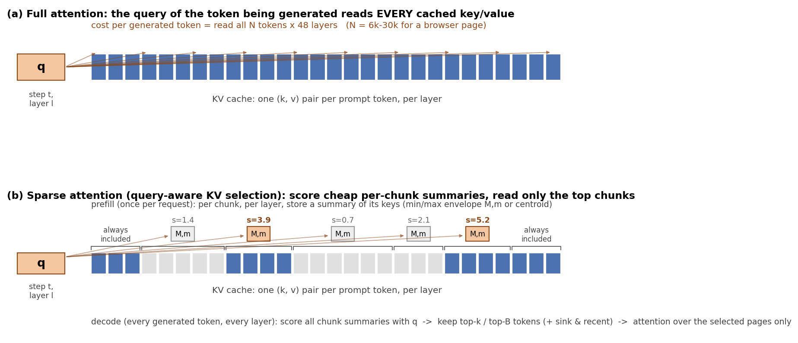
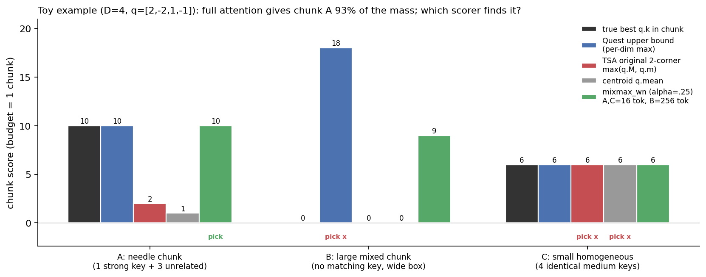
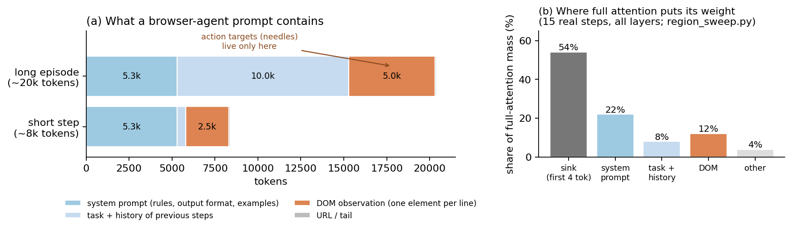
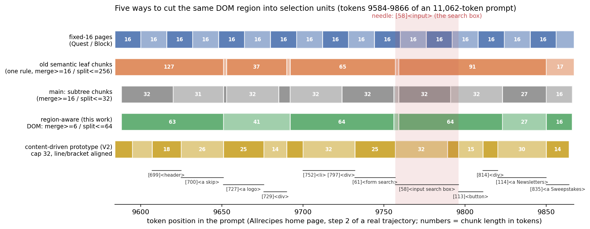
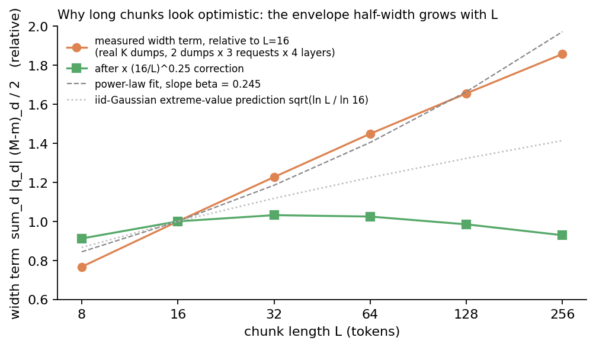
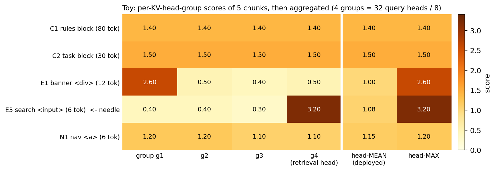
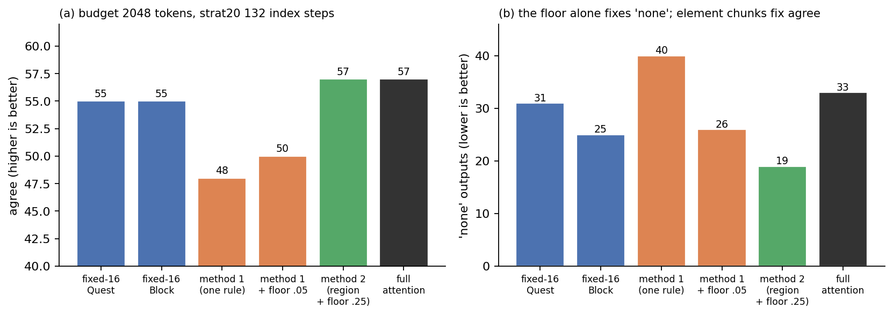
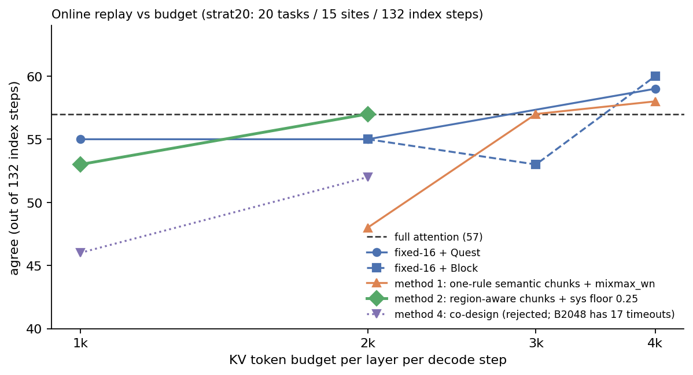
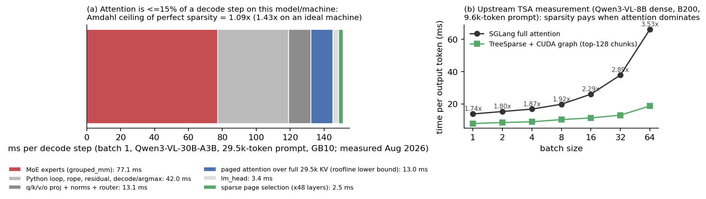

# Sparse Attention for Browser Agents 

## 1. The problem

A browser agent asks an LLM, at every step, "here is the page, which element do I click next?" That prompt is long: 6,000 to 23,000 tokens. While the model writes its answer, **every generated token must re-read the whole prompt** — once per layer, 48 layers in this model. The stored representation of the prompt (the **KV cache**) is about 98 KB per token, so a 20,000-token page means reading roughly 2 GB of memory for every single output token. **Sparse attention** is the idea of reading only a small, well-chosen part of it instead — for example 2,048 of the 20,000 tokens — without the model noticing.

## 2. What sparse attention actually does

*Figure 1. (a) Full attention: the query of the token being generated reads every cached key/value. (b) Sparse attention: the cache is split into chunks; each chunk has a cheap summary computed once; at every step the query scores the summaries and only the best chunks (plus a few always-kept ones) are read.*

Three facts to hold on to:

- **When it happens.** The selection is redone **at every generated token and in every layer**, because the query (the vector that says "what am I looking for right now") is different at every token and layer. Nothing is deleted from the cache; the next token may pick a completely different subset.
- **What is precomputed.** When the prompt is first processed, each chunk gets a summary of its keys: either the per-dimension **max and min** (an "envelope", used by Quest) or the **mean** (a "centroid", used by BlockSparse). Summaries are computed once and reused for every token afterwards.
- **What is always kept.** The first few tokens (the "attention sink"), the most recent 128 tokens, and everything already generated are read every time by every method. The **budget** — the number of tokens read per layer per step, for example 2,048 — is spent on top of that.

So a sparse-attention method is defined by exactly two choices: **how the cache is cut into chunks**, and **how a chunk is scored against the query**.

## 3. The traditional recipe, and how it fails

The standard methods (Quest, Vortex BlockSparse, LServe, ArkVale) all cut the cache into **fixed 16-token pages**, regardless of content, and score every page the same way for every prompt. Quest scores a page with an **upper bound**: the highest dot product any key in that page *could* have with the query, computed from the envelope. BlockSparse scores it with the dot product of the query and the page's mean key.

A tiny example shows what each score sees. Twelve tokens, three chunks of four keys, and a query that matches one key strongly:

*Figure 2. Chunk A holds the one key the query wants (true best score 10, and 93% of full attention's weight). Chunk B has no matching key at all but is large and varied. Chunk C is four identical, mildly relevant keys.*

- **Quest's upper bound** finds A (score 10, exactly right) — but gives B **18**, because a big, varied chunk has a wide envelope and the bound is optimistic. This is called **width bias**.
- **The centroid** gives A only **1**: the one good key is averaged away by three unrelated ones. This is called **dilution**.
- The original TSA scoring (a whole-vector max instead of a per-dimension max) gives A only **2**, because its width part cancels out whenever the query has mixed signs. Replacing it with the per-dimension form was the first fix in this project.
- On small, uniform chunks like C every method agrees. Fixed 16-token pages are mostly C-like, which is why on fixed pages the choice of score barely matters. Variable-length chunks create A-like and B-like chunks at the same time, so scoring suddenly matters a lot.

## 4. Why a browser agent's prompt is different

*Figure 3. (a) What the prompt contains. (b) Where full attention actually puts its weight, averaged over 15 real steps.*

The prompt has a fixed anatomy: about 5,300 tokens of **system prompt** (rules and output format), then the **task and history**, then the **DOM observation** — one line per page element, like `[58]<input placeholder="Find a recipe">`. The element the agent must act on is always one of those DOM lines. The system prompt is never a target, but if the model cannot see it, it forgets the output format and produces no action at all.

That creates two different needs inside one prompt: the DOM needs **fine, element-aligned units** so the one right line can be found; the system prompt needs **coverage**, not detail. Fixed 16-token pages serve neither well:

*Figure 4. The same 280 tokens of a real Allrecipes page cut five ways. The search box `[58]<input>` (red) spans four fixed-16 pages, so its number and its text land in different pages. The region-aware cut (green) keeps the search box and the search button together in one unit.*

## 5. What this project changed — four things

### 5.1 Cut on structure, with different sizes per region

The prompt is parsed into a tree (chat turns, DOM elements by indentation). Inside the DOM observation, one element subtree becomes one chunk (6 to 64 tokens). Outside it — system prompt, task, history — chunks are merged into coarse 64-to-256-token blocks, because those regions only need coverage. On a typical 11,000-token prompt this gives **204 units instead of 692** fixed pages, so there is a third as much to score.

### 5.2 Score with Quest's bound, but correct it for chunk length

Variable-length chunks make Quest's bound unfair: the wider a chunk, the more optimistic the bound, whether or not it contains anything useful (chunk B above). We measured this on real key vectors: the "width" part of the score grows like L^0.245 with chunk length L. So the score keeps Quest's formula but multiplies the width part by (16/L)^0.25 — no change for 16-token chunks, half for 256-token chunks.

*Figure 5. The width term of the bound grows with chunk length (orange). After the (16/L)^0.25 correction it is flat (green). The exponent 0.25 was chosen by an accuracy sweep first and matched the directly measured growth rate afterwards.*

This correction is what makes variable-length chunks usable at all: with the same chunks and no correction, agreement with the reference actions was significantly worse than fixed pages (89 vs 99 out of 190 steps); with it, the difference disappears (96).

### 5.3 Average the scores across query heads

The model has 32 query heads sharing 4 key/value heads. Instead of letting every head choose its own chunks (Quest's approach, which needs a custom kernel), the 8 queries that share a key/value head are averaged into one, and the 4 resulting scores are averaged into one score per chunk. All 32 heads then read the same set of chunks — one page table, 8× less scoring work, and compatibility with standard serving engines.

*Figure 6. The cost of averaging, in a toy: one head group (g4) strongly wants the search box, the others do not; the mean dilutes it to 1.08, below the navigation links. In practice this matters only at small budgets: at budgets of 3,000 tokens and up, averaging and taking the max give the same end-to-end result.*

### 5.4 Spend the budget in tokens, and reserve a share for the system prompt

Chunks are admitted in score order until the token budget is full. Before that, 25% of the budget is reserved for system-prompt chunks (still chosen by score within that region). The reservation fixes a specific failure: at a 2,048-token budget, without it the system prompt got only 7–14% coverage and the model often produced no action at all.

*Figure 7. Budget 2,048 tokens, 132 real steps. The reservation alone fixes the "no action" outputs (40 → 26) but not accuracy; element-level DOM chunks fix accuracy. Together they match full attention (57), versus 55 for the fixed-16 baselines.*

## 6. The numbers that matter

*Figure 8. Accuracy versus budget on 132 real agent steps (20 tasks, 15 websites). "Agree" means the model chose the same element as the reference trajectory when given the identical context.*

- **Large budget (4,096 tokens):** every reasonable method, ours included, is indistinguishable from full attention (96 vs 97 out of 190 steps; fixed-page baselines 98–99). Scoring and chunking stop mattering once the budget covers both the system prompt and the relevant DOM.
- **Medium budget (2,048 tokens):** the first version with one chunk-size rule for the whole prompt fell to 48; the region-aware version reaches **57 = full attention**, versus 55 for the fixed-page baselines (on a larger 190-step set: 94 vs 91, full attention 97). The gains over the baselines are within run-to-run noise; the gain over our own first version is not.
- **Small budget (1,024 tokens):** a tie with fixed pages (53 vs 55), but far fewer malformed outputs (8 vs 31 steps with no action).
- **Selection cost:** with 3–5× fewer units to score, the CUDA selector runs in 52–65 µs per layer per step versus 74–114 µs for fixed pages (1.4–1.75× faster).

One honest caveat about speed:

*Figure 9. (a) On this MoE model and machine, attention is at most 15% of the time to generate one token; even perfect sparsity could only make decoding about 9% faster. (b) On a dense 8B model on a B200, the upstream authors measured 1.7–3.5× — sparsity pays when attention dominates.*

## 7. What is and is not claimed

**Claimed:** structure-aligned chunking with region-specific sizes plus a system-prompt budget reservation (no prior work allocates KV budget by prompt region); the length correction that makes upper-bound scoring work on variable-length chunks; a clear map of when sparse attention is transparent (≥ 3k tokens), when it breaks (≤ 2k) and why; and a working CUDA kernel and serving integration.

**Not claimed:** the upper-bound formula (Quest), head averaging (already in TSA), tree chunking itself (already in TSA), and reusing selections across steps (LServe). We also do **not** claim higher accuracy than fixed pages — the claim is parity at equal KV reads with a third to a fifth of the scoring work, plus structural levers (region floors) that fixed pages do not have.

**Limits:** one model, one workload, teacher-forced step-level agreement rather than end-to-end task success, 132–190 paired steps per comparison. Several ideas were tried and rejected online — hierarchical tree descent, per-head max scoring on DOM chunks, prioritising interactive elements — and are documented in the full report so they are not repeated.

---

*Figures: `figures/bsa_report/` (regenerate with `make_figures.py`). Method details, code locations (file:line), statistics and the rejected experiments: `2026-09-03_bsa_project_report.en.md`.*
