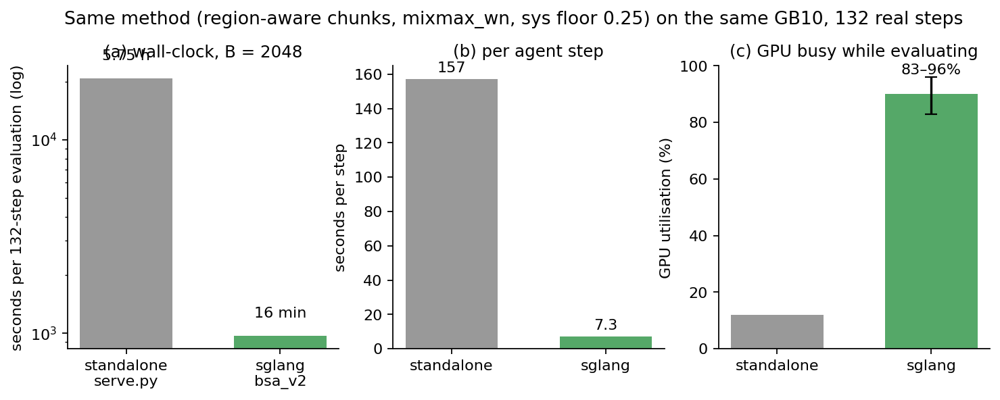
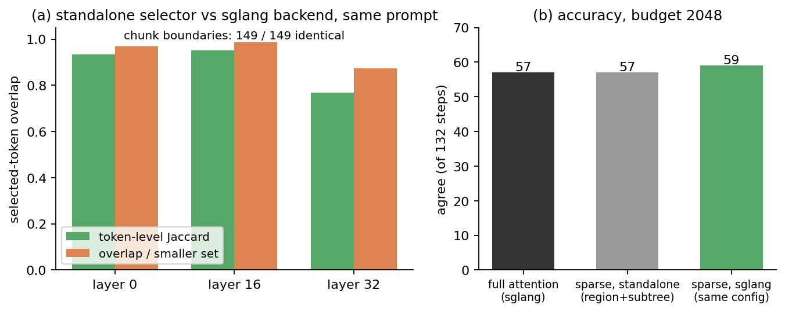
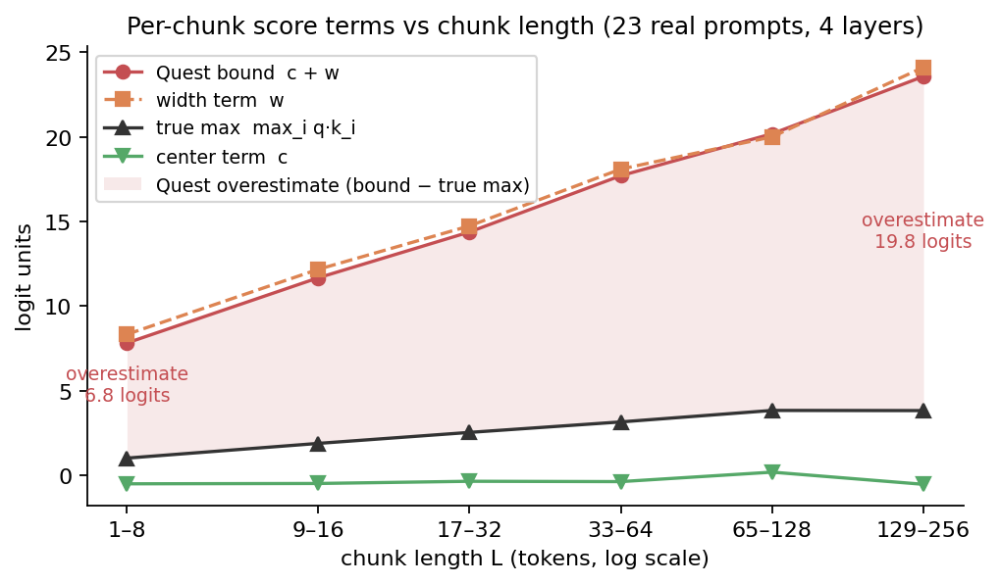
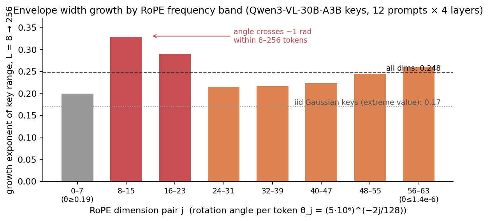
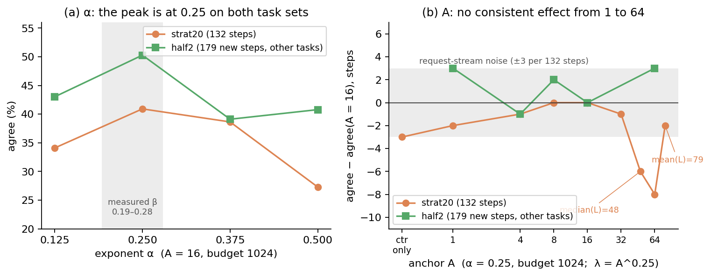
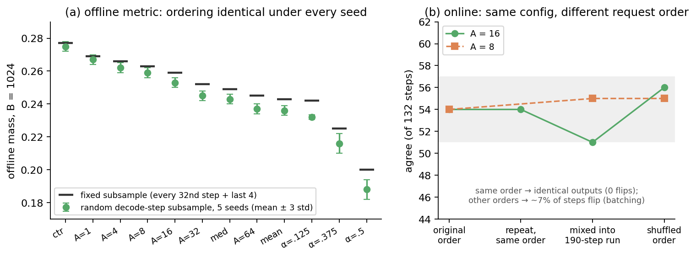
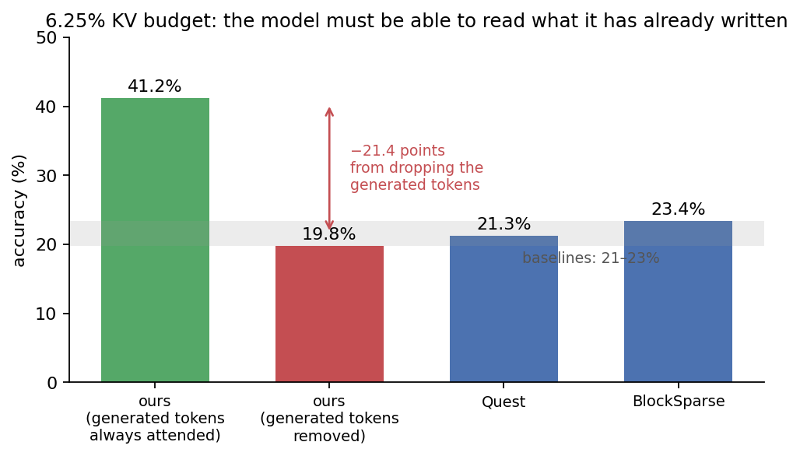

# Sparse Attention for Browser Agents — progress, Sep 3 → Sep 10

This note covers what changed since the Sep 3 report (`2026-09-03_bsa_project_report_simple.en.md`). That report explained the method: cut the prompt into structure-aligned, region-sized chunks; score chunks with Quest's upper bound corrected for chunk length by (16/L)^0.25; average scores across query heads; spend the budget in tokens with 25% reserved for the system prompt. This week had five threads: (1) the method now runs inside a real serving engine (sglang) and evaluations are 20× faster; (2) the code was consolidated onto `main` as one feature branch with every parameter documented; (3) the length correction — where the 16 and the 0.25 come from — now has a derivation, measured mechanisms and a literature position, backed by a 25-run hyperparameter study; (4) a robustness study (random seeds, request order, new tasks, other models, other chunk sizes) is running and about half done; (5) a separate experiment at a very small budget showed that the single most important token set is the model's own output.

## 1. Serving: the method runs in sglang, evaluations are 20× faster

The GB10 machine (sm_121a) is not officially supported by sglang. Getting it to run took a separate Python environment (torch 2.9.1), a source build of `sgl-kernel` for that architecture, and a rebuild of our own kernels. The sglang decode backend (`bsa_v2`) then gained the missing pieces of the method: region-aware chunking, the system-prompt reservation (made safe under CUDA graphs), and an absolute token budget.

*Figure 1. The same method, the same 132 real agent steps, the same GPU. The old standalone server evaluated one request at a time (12% GPU busy); sglang batches 13–23 requests (83–96% busy). One 132-step evaluation now takes 15–18 minutes instead of 5.75 hours. Sparse decoding is not faster than full attention on this MoE model (967 vs 652 s): attention is not the decode bottleneck here and the selection still has a per-request Python loop. That was not this week's goal; every experiment below used sglang.*

Before trusting it, the two implementations were compared on the same prompt:

*Figure 2. (a) Chunk boundaries are identical (149 of 149); the sets of selected tokens overlap 93–95% at layers 0 and 16 and 77% at layer 32 — the residual is a different budget-rounding rule (the standalone selector stops at the first chunk that exceeds the budget, sglang rounds to the nearest total) plus numerical drift with depth. (b) Accuracy at a 2,048-token budget: 59 of 132 steps agree with the reference actions in sglang, versus 57 for full attention in sglang and 57–60 for the standalone server (paired differences 10 W / 8 L, noise).*

## 2. Code: one feature branch on top of `main`

`main` had moved (new semantic chunker, head-handling changes). The region-aware method was re-applied on top of it as a minimal feature branch (`shiqihe/region-aware`, 12 commits, all parameters off by default), the older `mixmax` branch was deleted, and the README now lists every parameter with its default and the value used in the experiments (budget split, DOM 6–64 / other 64–256 chunk sizes, floor 0.25, scoring exponent, and the new anchor parameter of §3). The chunker is shared by the standalone server and the sglang backend, so the two paths cannot drift apart again.

`main`'s new semantic chunker was compared with ours as the fine-grained pass inside the DOM region (132 steps, budget 2,048): region + our subtree cut 57, region + main's chunker 55–60 depending on the DOM size limits, main's chunker alone 53, the fixed-page baseline 55, full attention 57. All within run-to-run noise, so the default stays the subtree cut and main's chunker is an option.

## 3. Why the length correction looks the way it does

Last week's report said the exponent 0.25 "was chosen by a sweep and matched the measured growth rate". The natural follow-up question was: why 16, why a power law, and can the anchor be something else (8, 32, 64, the median or mean chunk length)? The answer has four parts, each measured on real key vectors from 23 prompts (full write-up: `2026-09-11_anchor_exponent_study.zh.md`).

For reference, the score of one chunk (KV heads h = 1…4, each pooling its 8 query heads into q̄_h; M_h, m_h the per-dimension max and min of the chunk's keys; L the chunk length in tokens):

$$
s(\text{chunk})=\frac{1}{H_{kv}}\sum_{h=1}^{H_{kv}}\Bigg[\underbrace{\bar q_h\cdot\frac{M_h+m_h}{2}}_{c_h\ (\text{center})}+\Big(\frac{A}{L}\Big)^{\alpha}\underbrace{\sum_{d}|\bar q_{h,d}|\,\frac{M_{h,d}-m_{h,d}}{2}}_{w_h\ (\text{width})}\Bigg],\qquad A=16,\ \alpha=0.25 .
$$

With A = 16 and α = 0 this is exactly Quest's page score averaged over heads; (A/L)^α = A^α · L^(−α), so A only sets the weight λ = A^α of the width term (2 by default) and α its decay with chunk length.

**Why a correction is needed at all.** Under a token budget the selection is a knapsack problem: the right ranking is by attention mass *per token*. Quest's bound estimates the largest single-token score in a chunk, which grows with chunk length. For fixed 16-token pages the two rankings coincide, so Quest needs no correction; for 6-to-256-token chunks they do not. On real prompts the center term alone ranks chunks by per-token mass far better than the bound does (Spearman rank correlation +0.86 versus +0.22), and every increase of the width term's weight lowers that agreement (+0.84 at λ = 1, +0.76 at the deployed λ = 2, +0.64 at λ = 4).

*Figure 3. Real chunks grouped by length (log scale, each tick doubles L). The center term c is flat. The width term w and therefore Quest's bound c + w grow from 8 to 24 logits, while the true maximum dot product inside the chunk (max_i q·k_i, computed exactly from the stored keys) grows only from 1 to 4. The shaded area is Quest's overestimate, bound minus true max: 6.8 logits for the shortest chunks, 19.8 for the longest (e^7 to e^20 in softmax terms). The bound's value is almost entirely chunk length.*

**Why (A/L)^α.** The width term grows like w ≈ 17 + 47.6·ln L, which over 8–256 tokens is within ±9% of L^0.245. Multiplying it by L^(−0.25) makes its expectation flat in length; a log-form correction gives the same offline result, so the functional form is not special — the slope is. The exponent is a property of the model's keys, not of the workload:

*Figure 4. Keys are stored after rotary position embedding; each dimension pair rotates by θ_j per token. Pairs whose rotation angle crosses about 1 radian within 8–256 tokens (j = 8–23) grow fastest (exponent 0.29–0.33); already-saturated high-frequency pairs show only the extreme-value growth of iid content (0.20, the classical √(2 ln L)); slow pairs sit at 0.21–0.26. Summed over dimensions: 0.248, the same as the 0.245 measured on query-weighted width terms. A different model or RoPE base should have a different β, and α should follow it (being verified this week, §4).*

**What 16 is.** (A/L)^α = A^α · L^(−α): the anchor A only sets the weight λ = A^α of the width term (16 → λ = 2), the exponent sets the slope. There is no α′ that makes another anchor equivalent (proved in the report); replacing 16 by the median or mean chunk length just raises λ to 2.6–3.0 and, because those anchors sit on the typical chunk length, cannot even be matched approximately. 16 is the KV page size — it makes a 16-token chunk score exactly as in Quest — and λ = 2 is where the width term contributes about as much ranking variance as the center term (measured std ratio 1.3–2.5 across queries).

**What the experiments say.** 25 sglang runs at a 1,024-token budget (where scoring matters most), on 369 distinct steps over three stages, with a repeat run to calibrate noise:

*Figure 5. (a) The exponent has a sharp optimum at 0.25 on both task sets (strat20: 45 / 54 / 51 / 36 of 132; half2, 50 different tasks: 77 / 90 / 70 / 73 of 179). (b) The anchor does not matter between 1 and 64: every difference from A = 16 is inside the request-order noise band on at least one of the two sets, and the pooled 311-step counts are 145 / 142 / 146 / 144 / 139 for A = 1 / 4 / 8 / 16 / 64. The two "compensated" pairs (A = 8 with α = 0.15; A = 32 with α = 0.68) lost 6 and 18 steps, and dropping the width term entirely (center only) lost 3 — which is also what the Sep 3 toy example predicted for centroid-like scores at small budgets.*

Conclusion: keep 16 / 0.25. Changing the anchor buys nothing measurable; changing the exponent away from the measured growth rate costs 9–20 steps per 132–179. The anchor is now a documented parameter (`BSA2_WN_ANCHOR`, default 16) with unit tests.

## 4. Robustness study (in progress)

Two questions were raised: how sensitive are the offline numbers to random seeds, and is 16 / 0.25 an artifact of this task set, sample size or model?

*Figure 6. (a) The offline metric has no random component except which decode steps are sampled; under five random subsamples the ordering of 12 configurations is identical and the seed-to-seed spread (≤ 0.002) is far below the differences between configurations. Bootstrapping over prompts gives the same answer (paired differences vs A = 16 have 95% intervals that exclude zero). The growth exponent β is 0.245–0.247 over six seeds. (b) Online, the only randomness is request order: the same configuration in the same order reproduces exactly (0 of 132 steps flip); a different order flips about 7% of steps in both directions. So ±3 steps per 132 is noise, and the α effects (−9 to −20) are not.*

Status of the remaining runs (all on sglang, queue-driven):

| check | what | status |
|---|---|---|
| sample size / new tasks | α ∈ {0.125, 0.375, 0.5} and A ∈ {32, 64} on 179 steps from 50 unseen tasks | done: α −13 / −20 / −17 (peak at 0.25 confirmed); A = 32 −5, A = 64 +3, (A=1, α=0.5) +3 — no anchor effect |
| context | same scans with 2–4× longer chunks (DOM 16–128, other 128–512); a WebArena task set (Sean1999/webarena, 97 tasks, 152 steps, browser-use agent traces on Magento / Reddit / GitLab / OpenStreetMap) | WebArena done: α = 0.125 / 0.25 / 0.5 → 80 / 107 / 79 (p < 0.001 both sides); A = 1 / 16 / 64 → 117 / 107 / 96, center-only 110; β on WebArena vs WebVoyager prompts 0.245 vs 0.246; long-chunk geometry: α = 0.125 / 0.25 / 0.5 → 32 / 51 / 36 (p ≤ 0.017), A = 1 / 16 / 64 → 49 / 51 / 45 (noise) |
| model | β measured on Qwen3-VL-8B, Qwen3-8B, OLMo-2-7B, SmolLM2-1.7B; α / A scan on Qwen3-VL-8B in sglang | β = 0.242 / 0.242 / 0.255 / 0.249 (30B: 0.248) — the exponent is the same across RoPE bases 1.3e5–5e6, head dims 64/128, MHA/GQA; 8B in sglang: full attention 60, (16, 0.25) 40 (47 on a re-ordered request stream), α = 0.125 → 36, α = 0.5 → 43, A = 1 → 51, A = 64 → 44, center-only 43 — all within the 8B's ±7 stream noise except α = 0.125 |
| website / prompt length | per-site and per-length strata of the 311 existing steps | done: no stratum differs by more than 3 steps |

Reading so far: the exponent optimum is confirmed on unseen tasks and the anchor has no effect there either (A = 64 went from −8 to +3), so the anchor claim is now simply "no effect between 1 and 64"; dropping the width term entirely ties the default on the unseen tasks as well (90 vs 90 of 179). The growth exponent β is the same (0.24–0.26) on five models with very different RoPE bases and head geometries, so α = 0.25 transfers across models; the 8B's online α values (36 / 40 / 43) are within noise of each other, though sparsity at 1,024 tokens costs the 8B far more against full attention (20 steps vs 3 for the 30B). Remaining: center-only at 2,048 tokens, 8B anchors, a WebArena task set (100 tasks, browser-use agent traces) with the same scans, and the long-chunk geometry scan.

## 5. At small budgets, the model's own output is the token set that matters most

A separate experiment this week varied one thing: whether the tokens the model has already generated in the current step (its partial answer — the reasoning text and the JSON action being written) can be attended to, or are dropped from the attended set like any other low-scoring token. The budget was 6.25% of the KV cache, far below the 1,024–4,096-token budgets used elsewhere in these reports.

*Figure 7. Accuracy at a 6.25% KV budget. Our method with the generated tokens always attended: 41.2%. The same method with the generated tokens removed from the attended set: 19.8%. Quest and BlockSparse in the same setting: 21.3% and 23.4%.*

**What happens.** Removing the generated tokens costs 21 points and puts our method exactly where the two baselines are. Everything else — chunking, scoring, the system-prompt reservation — is identical between the two green/red bars. So at this budget the ordering "ours 41 vs baselines 21–23" is not a statement about chunk scoring; it is a statement about which tokens are guaranteed to be readable.

**Why the generated tokens matter this much.** During decoding the query at each new token is produced from the token just written, and the model's attention is strongly local: the tokens it wrote a moment ago carry the state of the answer — which JSON field is open, which reasoning step is in progress, which element index is half-emitted. The prompt tells the model *what* to do; its own output tells it *where it is* in doing it. At a 6.25% budget the prompt side is already heavily rationed, so the model leans on its output even more. Take that away and generation loses its thread: repeated or malformed JSON, restarted reasoning, wrong or missing indices. This is the same failure family as the "no action" outputs that the system-prompt reservation fixed at a 2,048-token budget (Sep 3 report, Fig. 7): whenever the tokens that hold *format state* fall out of the attended set, accuracy collapses regardless of how well the DOM chunks are chosen.

**Why the baselines sit at 20%.** In a page-based scheme the generated tokens are appended to the cache and fill the most recent pages, which then compete for the budget with every prompt page. A partially filled page has a summary built from a few tokens, and a top-k over thousands of pages can and does leave it out; when it does, the model is in the "removed" condition of Figure 7. Our method never lets that happen: generated tokens (with the first tokens and the last 128) are attended on top of the budget, and they cost almost nothing — a few hundred tokens against a cache of tens of thousands.

**What this means for comparisons.** A fair comparison of *scoring* methods must give every method the same always-attend rule; that is how the sglang evaluations in §1–§4 are set up (identical always-include set for ours, Quest and BlockSparse), which is why the differences there are a few steps rather than 20 points. The result above is still useful as a design rule for any sparse-decoding system: the generated tokens and a short recent window are not candidates for eviction. The 6.25% number is also a reminder of the regime boundary: with the rule in place, accuracy at 6.25% is 41% — usable for a fallback, not for production — while at 2,048 tokens (about 10–20% of these prompts) the method matches full attention.

## 6. What is and is not claimed this week

**Claimed:** a working sglang integration of the full method with verified selection equivalence and ~21× faster evaluation; a derivation of the length correction (knapsack → density; bound bias grows with length; RoPE and extreme-value growth explain the measured exponent) with the anchor shown to be a free width weight and the exponent pinned by the model; a 25-run study showing the exponent is the only sensitive parameter; and the observation that at very small budgets the guaranteed readability of the model's own output dominates every other design choice.

**Not claimed:** any accuracy gain over fixed pages (unchanged from last week: parity), any decode speedup over full attention on this MoE model, and — until §4 finishes — transfer of the exact values to other models or chunk geometries.

---

*Figures: `figures/bsa_report/fig18–fig24` (regenerate with `make_figures_sep10.py`). Details and statistics: `2026-09-11_anchor_exponent_study.zh.md` (anchor / exponent study, verification), `2026-09-01_codesign_report_mixmax_region_aware.zh.md` §8 (sglang validation), `2026-09-02_chunking_comparison.zh.md` (chunker comparison).*
